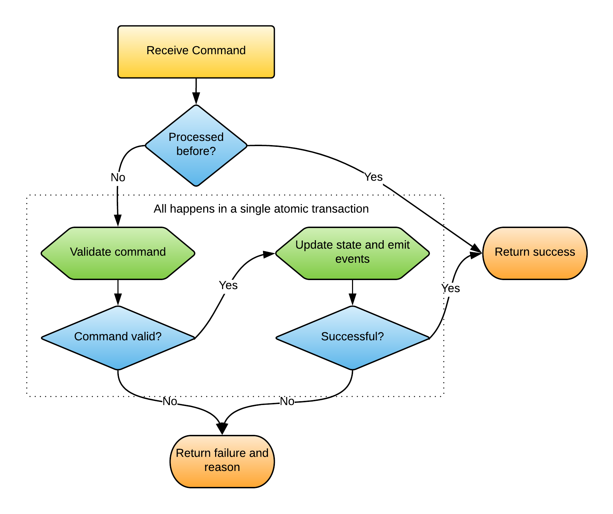

class: center, middle

# Event Sourcing with Free Monads

---

## Background

* I work at Simple Machines, a tech consultancy
* I'm from South Africa, but was living in NZ for last 4 years
* Worked in many languages, for the last 4 years mainly in Scala

--

### How I got interested in this topic

* Was writing in Scala using free monads
  - Happy with the Doobie / Postgres stack
* I started working on a graph DB proof of concept
* The only graph DB implementation I liked was in-memory

--

Event sourcing came to the rescue!

--

Then working on an event sourcing project at Simple Machines
* Refined my understanding of event sourcing
* Got an urge to revisit the free monad approach

---

## Event sourcing

In an event sourced system:

* ***Events*** are the changes that happen to a domain
* These changes are stored in an ***event log***
--

* This event log is the the ***single source of truth***
* All domain state at all points in time can be derived from it
--


These events are ***immutable***.

---

## Examples:

### Version control systems

* *commits* are the events, and the source of truth
* The *source tree* is derived state

--

### Accounting systems

* The *double entry general ledger* is the event log
* The *balance sheet* is the cumulative state at a point in time
* The *income statement* is a windowed aggregation of events

---

### Distributed Streaming Architectures

* Modern distributed data arcitectures getting data from everywhere
* User expects latest data to be available in near realtime
--

* Large datasets to move around
  - Can't move state snapshots - too big
  - Have to move around the *changes to state*
  - That's exactly what *events* are

--


If we process the data as events, why not store it that way?


---

## CQRS

CQRS stands for ***command query responsibility segregation***

* Separate all system interaction into reads and writes
* Often split into separate services
* Optimise the read and write functions for their respective workloads

--

### Main principle

* A ***query*** (read) does not modify state
* A ***command*** (write) does not reveal state

---

## CQRS - consistency requirements

* *Consistency comes at a price*

--

#### *Query subsystem*
- *eventual consistency* is often good enough
- Eventually consistent is easier to scale horizontally
- *CAP theorem*: prefer availability to consistency (to a point)

--

#### *Command subsystem*
- Often requires stronger consistency
- *Causal consistency* at a minimum
- *CAP theorem*: prefer consistency to availability

--

*Many workloads are read heavy*

---

## Event sourcing and CQRS

*CQRS* and *event sourcing* are often seen altogether:

--

* Messy trying to do event sourcing without CQRS
  - Rather maintain a clear distinction betweem reads and writes
--

* If using *CQRS*, a good way to decouple read from write is:
  - write subsystem publishes events to *event log*
  - read subsystem subscribes to *event log* and creates view
  - in other words event sourcing :)

---

## Event sourcing and CQRS

<div style="width:85%" class="image-block"></div>

---

## Event sourcing - components

#### *Command subsystem*
- Accepts and validates *commands* and generates *events*

--

#### *Message queue*
- Persists events
- Propagates events downstream
- Kafka is very good at this

--

#### *Query subsystem*:
- Constructs *materialised views* or ***projections*** from the event stream
- Kafka streams, combined with Kafka connect is very good at this
- E.g. can be used to populate indexes in Elasticsearch

--

Here we're most interested in the *command* side,
particularly when validation requirements are complex

---

## Command processor

Command processors consists of:

* A view of the current domain state
* Mechanisms to:
  - *Validate* a command against this state
  - *Emit* a sequence of events denoting the changes
  - *Update* current state


---

## Command processor

Command processors must:

* Be entirely *self-validating*
  - Input can be any instance of the required type
  - No reliance on any other service or process
--

* Support *concurrent updates*
  - Unrelated requests should be processed concurrently  
--

* Provide an *ACID transactional guarantee*
  - *Validate*, *update*, and *emit* in a *single atomic transaction*
--

* Support *idempotence*
  - This is essential for *sagas*
--

* Only publish events, and reveal no internal state

--

In other words they must be bullet proof black boxes

---

## Command processor

<div style="display: block;margin-left: auto;margin-right: auto;width: 80%;"></div>

---

## Free monads

The free monad pattern consists of:

* An ***algebra*** of operations, or instructions

  In Scala this is expressed as a *sealed trait* or ADT

  ```scala
  sealed trait UserOp[A]
  final case class AddUser(id: UUID, name: String) extends UserOp[Unit]
  final case class GetUser(id: UUID) extends UserOp[String]
  ```
--

* A mechanism for "lifting" this *algebra* into a special monad, the free monad `Free[F[_], ?]`

  Eg:

  ```scala
   val f: Free[UserOp, Unit]: AddUser(id, name).liftF
  ```
--

Most have utility belt of such operations, normally as implicit conversion extension methods

---

## Free monads

An ***interpreter*** is a way to transform from the *algebra* to a more concrete monad such as `IO`.

In Scala these are expressed as natural transformations `~>`, a bit like a higher-kinded functor:

```scala
trait ~>[F[_], G[_]] {
  def apply[A](fa: F[A]): G[A]
}
```

--

E.g. here is a transformation `UserOp ~> IO`

```scala
import scala.collection.mutable.Map
val userMap: mutable.Map[UUID, String] = Map.empty

object userInterpreter extends (UserOp ~> IO) {
* override def apply[A](fa: UserOp[A]): IO[A] = fa match {
*   case AddUser(id, name) => IO { userMap += ((id, name)) }
*   case GetUser(id)       => IO { userMap(id) }
* }
}

```

---

## Free monads

Here is a simple (not very useful) free monad *program*

```scala
val program: Free[UserOp, String] = for {
  _ <- AddUser(id, name).liftF
  u <- GetUser(id).liftF
} yield u
```

and now we can interpret it and run:

```scala
val u: String = program.foldMap(userInterpreter).unsafeRunSync
```

--

Why free monads for event sourcing?

--

<div class = "box-red">
Free monad programs are data
 </div>

---

## Combining free monads

If `F[_]` and `G[_]` are algebras, we can create a union algebra with the coproduct `EitherK[F, G, ?]`

We can get an interpreter for `EitherK[F, G, ?]` from the `F` and `G` intepreters

```scala
  type F[_]; type G[_]; type M[_]

  type H[A] = EitherK[F, G, A]
  val f2M: F ~> M
  val g2M: G ~> M

* val h2M: H ~> M = f2M or g2M
```

So we can combine algebras into richer algebras

---

## Chaining free monads

If `F[_]` and `G[_]` are algebras, and `M` is any monad,
we can chain interpreters

```scala
  type F[_]; type G[_]; type M[_]

  val f2FreeG: F ~> Free[G, ?]
  val g2M: G ~> M
  implicit val m: Monad[M]

* val f2M: F ~> M = f2FreeG.andThen(Free.foldMap(g2M))
```

---

## Free monad interpreters

With theses simple combinators
* We create simple algebras
* Combine these together to create more complex ones
* Create interpreters that step down a level of abstraction at a time
* Finally interpreting to `IO` (functional bare metal)
* Glue it together by playing interpreter Lego

--

We can think of our application architecture as a directed graph
* Algebras are the *vertexes*
* Interpreters are the *edges*

---

## CRUD app

A simple free monad architecture.

<div style="width:70%" class="image-block"></div>

---

## From CRUD app to event sourcing

Some changes are required:

* Client may have to interact with a separate read service
* Results of commands only observable asynchronously
* Client BYO ID when creating a new object
  - Avoid the pattern of a create operation returning an ID
* Ids UUIDs rather than integers


---

## Command processor algebras

Let's work out what algebras we need for an event sourced app (the vertexes)

--

* `CommandOp`
* `EventOp`
--

* `QueryOp`
  - only used for validation
  - not exposed outside the service
--

* `LoggerOp`
  - logs events to the event log

---

## Design elements - algebras

### Further requirements:

**Commands** must:
- have an ID
- return `Either[Error, Unit]`

--

**Events** must:
- have a partition key
- be associated with a command
- return `Either[Error, Unit]`
  + they can also fail with domain errors

--

**Queries** can:
- Return any domain value  

---

## Interpreters

Next we work out what interpreters we need (the edges)

--

* `CommandOp ~> Free[EitherK[QueryOp, EventOp, ?], ?]`
  - QueryOp to fetch the domain state
  - EventOp update internal state
      + We'll hijack them and log them

--

* Other algebras to a abstract monad `M`
  - `EventOp ~> M`
  - `QueryOp ~> M`
  - `LoggerOp ~> M`

We can leave `M` abstract to begin with.

--

For an implementation, we're going to use the ***Doobie*** `ConnectionIO` monad

`ConnectionIO` is a free monad representing Sql statements that are processed in a single transaction

---

## Command processor

<div style="display: block;margin-left: auto;margin-right: auto;width: 80%;"></div>

---

## Abstract definitions

```scala
trait EventSourcing {

  // abstract definitions
  type C[_] // command
  type E[_] // event
  type Q[_] // query
```
* We can work at quite a high degree of abstraction by defining an abstract `EventSourcing` trait, and
defining abstract types for command, event and query algebras

* We'll be able to reuse this across multiple implementations

---

## Abstract definitions

```scala
trait EventSourcing {

  // abstract definitions
  type C[_] // command
  type E[_] // event
  type Q[_] // query

* final case class CommandSpec(commandId: UUID)
* def asCommandSpec[A]: C[A] => CommandSpec
```

* Command operations must have a command ID

---

## Abstract definitions

```scala
trait EventSourcing {

  // abstract definitions
  type C[_] // command
  type E[_] // event
  type Q[_] // query

  final case class CommandSpec(commandId: UUID)
  def asCommandSpec[A]: C[A] => CommandSpec

* type EventKey   // event key
* type EventValue // event value
* final case class EventSpec(key: EventKey, event: EventValue, commandId: UUID)
* def asEventSpec[A]: E[A] => EventSpec
```

* Add an abstract `Event` type and the event `Key`
  - This is what gets serialised
* Event operations must have a key, and be associated with a command

---

## Abstract definitions

```scala
trait EventSourcing {

  // abstract definitions
  type C[_] // command
  type E[_] // event
  type Q[_] // query

  final case class CommandSpec(commandId: UUID)
  def asCommandSpec[A]: C[A] => CommandSpec

  type EventKey   // event key
  type EventValue // event value
  final case class EventSpec(key: EventKey, event: EventValue, commandId: UUID)
  def asEventSpec[A]: E[A] => EventSpec

  // the logging algebra
* sealed trait L[A]                                   extends FreeOp[L, A]
* final case class Append(eventSpec: List[EventSpec]) extends L[Unit]
* final case class Exists(commandId: UUID)            extends L[Boolean]
```

* Define the logging algebra.
* This is generic, we can define it more concretely.

---

## Wiring the algebras

The goal is given the following interpreters for our abstract types:

* `C ~> Free[EitherK[Q, E, ?], ?]` where
  - Interprets command in terms of queries `Q` and events `E`
  - `Q` to fetch the internal domain state
  - `E` to update this state
* Other algebras to an abstract effect processing monad `M`
  - `E ~> M`, `Q ~> M`, `L ~> M`

--

We can create an intepreter `C ~> M` that does what we want:
* Interprets commands in terms of queries and events
* Interprets queries and events in terms of operations in `M`
* Records the events in a list
* Tries to update internal state
* If successful, writes the events to the event log

---

## Simple Implementation

```scala
type FEQ[A] = Free[EitherK[Q, E, ?], A]

def c2MLogged[M[_]](c2EQ: C ~> FEQ, e2M: E ~> M, q2M: Q ~> M, l2M: L ~> M)(implicit M: Monad[M]): C ~> M = {
  type EL[A] = EitherK[E, L, A]
  type FEL[A] = Free[EL, A]

  val e2MLogged: E ~> M = new (E ~> M) {
    override def apply[A](ea: E[A]): M[A] = {
      // interleave the append and logging instructions
*     val fEL: Free[EL, A] = for {
*       _ <- Append(List(asEventSpec(ea))).inject[EL]
*       ea <- Free.liftF[E, A](ea).inject[EL]
*     } yield ea

      fEL.foldMap(e2M or l2M)
    }
  }

  val fEQ2M: FEQ ~> M = Free.foldMap(e2MLogged or q2M: EQ ~> M)
  def c2M: C ~> M = c2EQ.andThen(fEQ2M)
  c2M
}
```

---

## Implementation with Idempotence

```scala
type FEQ[A] = Free[EitherK[Q, E, ?], A]

def c2MLogged[M[_]](c2EQ: C ~> FEQ, e2M: E ~> M, q2M: Q ~> M, l2M: L ~> M)(implicit M: Monad[M]): C ~> M = {
  type EL[A] = EitherK[E, L, A]
  type FEL[A] = Free[EL, A]

  val e2MLogged: E ~> M = new (E ~> M) {
    override def apply[A](ea: E[A]): M[A] = {
      // interleave the append and logging instructions
      val fEL: Free[EL, A] = for {
        _ <- Append(List(asEventSpec(ea))).inject[EL]
        ea <- Free.liftF[E, A](ea).inject[EL]
      } yield ea

      fEL.foldMap(e2M or l2M)
    }
  }

  val fEQ2M: FEQ ~> M = Free.foldMap(e2MLogged or q2M)
  def c2M: C ~> M = c2EQ.andThen(fEQ2M)

  new (C ~> M) {
    override def apply[A](fa: C[A]): M[A] =
*     for {
*       exists <- Exists(asCommandSpec(fa).commandId).liftF.foldMap(l2M)
*       a      <- if (exists) c2Id(fa).pure[M] else c2M(fa)
*     } yield a
  }
}
```

---

## Writer monad

```scala
final case class WriterT[F[_], L, V](run: F[(L, V)]) {
  ...
  def flatMap[U](f: V => WriterT[F, L, U])(
    implicit flatMapF: FlatMap[F],
    semigroupL: Semigroup[L]): WriterT[F, L, U] =
    WriterT {
      flatMapF.flatMap(run) { lv =>
        flatMapF.map(f(lv._2).run) { lv2 =>
          (semigroupL.combine(lv._1, lv2._1), lv2._2)
        }
      }
    }
```

* Lets you log each operation and build up a list as you go
* Enables batching writes to event log
* Possible performance optimisation
  + Can insert all events in single query
* Haven't implemented this optimisations  

---

```scala
def c2MLogged[M[_]](
    c2U: C ~> FEQ, e2M: E ~> M, q2M: Q ~> M, l2M: L ~> M)(
      implicit M: Monad[M]): C ~> M = {

  type WM[A] = WriterT[M, List[EventSpec], A]

  val e2WM: E ~> WM =
    new (E ~> WM) {
      override def apply[A](fa: E[A]): WM[A] =
        WriterT[M, List[EventSpec], A](e2M(fa).map(x => (List(asEventSpec(fa)), x)))
    }

  val q2WM: Q ~> WM = new (Q ~> WM) {
    override def apply[A](fa: Q[A]): WM[A] =
      WriterT[M, List[EventSpec], A](q2M(fa).map(x => (List.empty, x)))
  }

  val c2WM: C ~> WM = new (C ~> WM) {
    override def apply[A](fa: C[A]) = c2U(fa).foldMap(q2WM or e2WM)
  }

  new (C ~> M) {
    private def doApply[A](fa: C[A]) = c2WM.apply(fa).run.flatMap {
      case result @ (updateList, Right(_)) => Append(updateList).liftF
                                                .foldMap(l2M) >> result._2.pure[M]
      case (_, a)                          => a.pure[M]
    }

    override def apply[A](fa: C[A]): M[A] = for {
        exists <- Exists(asCommandSpec(fa).commandId).liftF.foldMap(e2M)
        a      <- if (exists) c2Id(fa).pure[M] else doApply(fa)
      } yield a
  }
}
```


---

## Doobie implementation

We now specialise our implementation to one backed internally by Postgres

* Choose `M` to be the free monad `ConnectionIO`
--

* Create a event table
  ```sql
  create table event(
      id serial primary key not null,
      created timestamp with time zone default current_timestamp not null,
      payload jsonb not null,
      partition_key uuid not null,
      command_id uuid not null
  );
  ```
  We're using Postgres json for event serialisation for convenience

---

## Doobie implementation

```scala
  trait EventSourcingToDb extends EventSourcing {

    // Metas are required to convert Scala types to Sql types
    def keyMeta: Meta[EventKey]
    def valueMeta: Meta[EventValue]

*   private def logOp2ConIO = new (L ~> ConnectionIO) {
*     implicit val km: Meta[EventKey]   = keyMeta
*     implicit val vm: Meta[EventValue] = valueMeta
*     override def apply[A](fa: L[A]): ConnectionIO[A] = fa match {
*       case Append(events) => sql.append(events)
*       case Exists(commandId) => sql.exists(commandId)
*     }
    }
```

* Implement the logging interpreter
  ```
  def logOp2ConIO: L ~> ConnectionIO
  ```
* `sql.append` and `sql.exists` are Doobie Sql queries

---

## Doobie implementation

```scala
  trait EventSourcingToDb extends EventSourcing {

    // Metas are required to convert Scala types to Sql types
    def keyMeta: Meta[EventKey]
    def valueMeta: Meta[EventValue]

    private def logOp2ConIO = new (L ~> ConnectionIO) {
      implicit val km: Meta[EventKey]   = keyMeta
      implicit val vm: Meta[EventValue] = valueMeta
      override def apply[A](fa: L[A]): ConnectionIO[A] = fa match {
        case Append(events) => sql.append(events)
        case Exists(commandId) => sql.exists(commandId)
      }
    }

*   def commandOp2IO(c2CF: C ~> FEQ,
*                    q2CIO: Q ~> ConnectionIO,
*                    e2CIO: E ~> ConnectionIO,
*                    transactor: Transactor[IO]): C ~> IO =
*     c2MLogged[ConnectionIO](c2CF, e2CIO, q2CIO, logOp2ConIO("event"))
*       .andThen(transactor.trans)
  }
```

* Given an Doobie `Transactor` we can now create an interpreter to ***`C ~> IO`***

---

## Domain specific algebras

* We're done with the generic boiler populate
* We now create our domain specific algebras
  - `MyCommandOp`
  - `MyEventOp`
  - `MyQueryOp`
* Once we can have these, we can create a concrete `EventSourcing` implementation and wire these in

---

## Domain specific algebras

### Command
```scala
  sealed trait MyCommandOp[A]

  sealed trait MyCommand
  final case class MyCommandSpec(commandId: UUID, command: MyCommand)
      extends MyCommandOp[Attempt[Unit]]
```
* because we don't need a polymorphic return type, we can eliminate the higher-kindedness and end wrap our commands
in a single operation of the `MyCommandOp` algebra

---

## Domain specific algebras

### Command
```scala
  sealed trait MyCommandOp[A]

  sealed trait MyCommand
  final case class MyCommandSpec(commandId: UUID, command: MyCommand)
      extends MyCommandOp[Attempt[Unit]]

  // our actual commands
* final case class MyCommand1(...) extends MyCommand
* final case class MyCommand2(...) extends MyCommand
  ...
```

* because we don't need a polymorphic return type, we can eliminate the higher-kindedness and end wrap our commands
in a single operation of the `MyCommandOp` algebra

---

## Domain specific algebras

### Event
```scala
  sealed trait MyEventOp[A]
  final case class EventSpec(key: UUID, event: MyEvent, commandId: UUID)
      extends MyEventOp[Attempt[Unit]]

  // our events
* sealed trait MyEvent
* final case class MyEvent1(...) extends MyEvent
* final case class MyEvent2(...) extends MyEvent
  ...
```
* again we end up with a single operation in `MyEventOp`

--

### Query

* This is just a regular algebra with any return type

---

## Domain specific event sourcing

```scala
  object MyEventSourcing extends EventSourcingToDb {
*   override type C[A]  = MyCommandOp[A]
*   override type Q[A]  = MyQueryOp[A]
*   override type E[A]  = MyEventOp[A]
*
*   override type EventValue = MyEvent
*   override type EventKey   = UUID
  }
```

* Override abstract higher kinded types with our own algebras
* Override the abstract event key and value types with our own

---

## Domain specific event sourcing

```scala
  object MyEventSourcing extends EventSourcingToDb {
    override type C[A]  = MyCommandOp[A]
    override type Q[A]  = MyQueryOp[A]
    override type E[A]  = MyEventOp[A]

    override type EventValue = MyEvent
    override type EventKey   = UUID

*   override def asEventSpec[A] = {
*     case MyEventSpec(key, event, commandId) => EventSpec(key, event, commandId)
*   }
*
*   override def asCommandSpec[A] = {
*     case MyCommandSpec(commandId, _) => CommandSpec(commandId)
*   }
  }
```

* Create implementations that satisfy the requirements for events and command algebras
  - Commands have an ID
  - Events have a key, and are associated with commands

---

## Domain specific event sourcing

```scala
  object MyEventSourcing extends EventSourcingToDb {
    override type C[A]  = MyCommandOp[A]
    override type Q[A]  = MyQueryOp[A]
    override type E[A]  = MyEventOp[A]

    override type EventValue = MyEvent
    override type EventKey   = UUID

    override def asEventSpec[A] = {
      case MyEventSpec(key, event, commandId) => EventSpec(key, event, commandId)
    }

    override def asCommandSpec[A] = {
      case MyCommandSpec(commandId, _) => CommandSpec(commandId)
    }

*   def getEventValueMeta(implicit d: Decoder[MyEvent],
*                    e: Encoder[MyEvent],
*                    typeTag: TypeTag[MyEvent]): Meta[Event] =
*     Meta[Json].xmap[Event](_.as[Event].fold[Event](_ =>
*       throw new Exception("Decoding Error"), identity)
*       a => a.asJson)
*   override val valueMeta = getEventValueMeta
*   override val keyMeta   = implicitly[Meta[UUID]]
  }
```
* Create the necessary `Meta`s for conversion between Scala and Sql
---

## We're there!

Now we just create the desired command interpreter:

```scala
val command2IO: MyCommandOp ~> IO = MyEventSourcing.commandOp2IO(
                   myCommand2EventQuery,
                   myQuery2ConnectionIO,
                   myEvent2ConnectionI0,
                   myTransactor)
```
---

class: center, middle

# Demo
---

## Event ordering and consistency

Events have IDs (integer), timestamps, and Command IDs
- Not completely deterministic
- No unique ordering of events in the log
- Ordering in accordance with original transaction semantics
- Replaying events will restore original internal state if:
  + grouped into transactions by command ID
  + replayed in order of timestamp or event ID


---

## The event log

Next step is to get the event log into Kafka:
* Stream into a single topic, partitioned by the event key
* Much simpler task than standard CDC
  - Data is already "Kafka ready"
  - Only a single table is monitored
  - Only appends, no updates and deletes
* Debezium may be a good choice
  - Debezium only for the event subscription (Debezium embedded)
  - Either create a bespoke connector
  - Or roll own producer

---

## Summary

What we have so far:

* *Reusable boiler plate code*
  - Only need to implement the domain specifics
* *Separation of concerns*
  - Commands in terms of abstract event and query operations
  - Events and queries in terms of DB operations (separately)
  - No logging code mixed into domain code
* *internally event sourced*
  - Internal state updates via events means we haven't missed anything
* *Concurrency and transactions*
  - Commands handled in atomic operations
  - Unrelated operations execute concurrently
* *A pure functional implementation :)*

---

## Some observations

Similar to standard CDC, but different
* CDC also captures change events, and propagates to Kafka or other streaming platform
* But it's not event sourcing.
  + We can't tear down the datastore and rebuild it from the event log

--

We can go back to a CRUD app  
* We just expose the `QueryOp` algebra into a web service, instead of making it private
* We're still doing event sourcing and we're still doing CQRS
  + Command and query separation at a different level of abstraction
* So we can get all the benefits of event sourcing
  + All the benefits of event sourcing
  + In the end few changes from a typical non-event sourced architecture


---

## Other Applications

Free monad interceptor patterns have a lot of potential applications

* Notification mechanism
  - Extra complexity - if includes logic for notification recipient
* Powering front ends
  - Event driven data invalidation
  - Just an idea at this stage
* More low level potential application:- code generation


---

## Tagless Final

Sure we could do something for a specific algebra, but can we abstract?

--

TF algebra is trait, and behaviour is defined by methods.

So it seems harder to abstract over

E.g. for all free algebras, `F` and `G`:
```
trait Foo {
  type F[_]; type G[_]
  def f2G: E ~> Free[G, ?] = ???
}
```
Is there a way of talking about *all* TF algebras?

--

TBH: I don't know


---

class: center, middle

Source code at:

[https://github.com/szoio/freesourcing](https://github.com/szoio/freesourcing)

# Questions?
